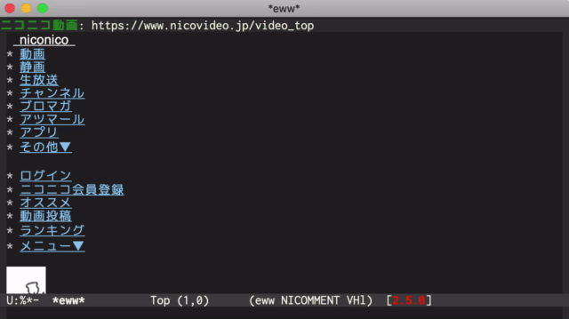

emacs-nicomment
===============

Reproduces the flowing comment of [ニコニコ動画](https://www.nicovideo.jp) on Emacs.



Inspired by https://github.com/kusabashira/vim-nicomment

Requirements
---------------

- [posframe](https://github.com/tumashu/posframe)

Usage (based on demo with [Cask](https://cask.readthedocs.io/en/latest/))
---------------

1. Install dependent libraries

    ```sh-session
    $ cask install
    ```
  
1. Lanch Emacs

    ```sh-session
    $ cask exec emacs -Q nicomment-demo.el -l nicomment
    ```
    
1. Enable `nicomment-mode`

    ```
    M-x nicomment-mode
    ```
    
1. Execute demo script

    ```
    M-x nicomment-demo
    ```
    
License
---------------

MIT License
